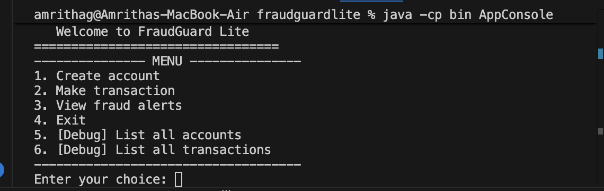
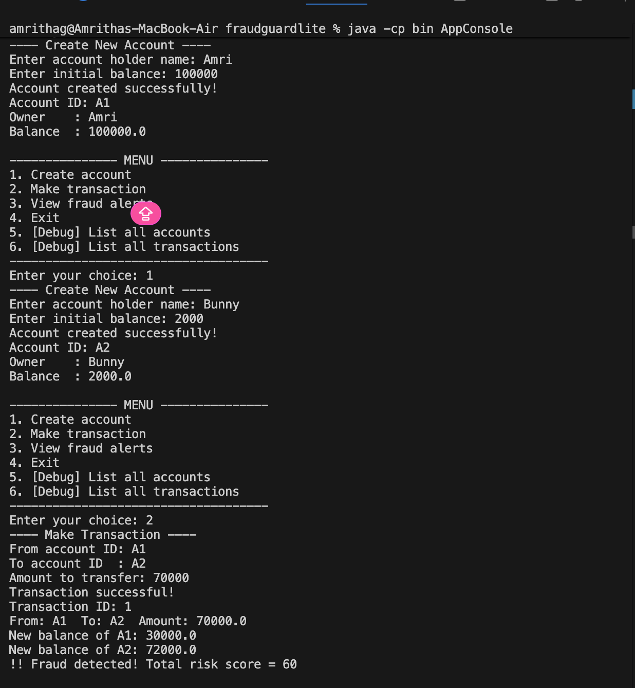
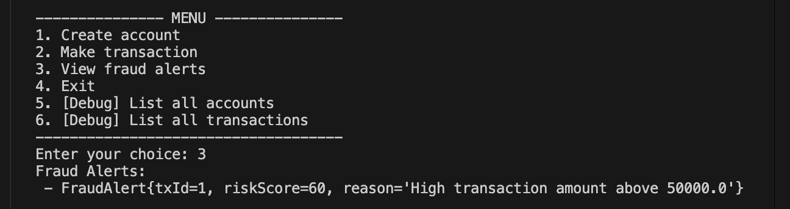

# FraudGuard Lite 

**FraudGuard Lite** is a lightweight Java console application that simulates bank-style transactions and detects suspicious activity using a modular rule engine and risk scoring. 
It demonstrates core backend engineering skills: OOP design, pluggable rule modules (High Amount, Velocity, Blacklist), transaction validation, alerting and real-world fintech concepts .

---

## Features

- Create accounts with an initial balance  
- Transfer money between accounts (with validation)  
- Fraud engine with pluggable rules:
  - **HighAmountRule** — flags very large transfers
  - **VelocityRule** — flags many quick transfers from the same account
  - **BlacklistRule** — flags transfers to blacklisted receivers
- Rules return risk scores; total risk is compared with a threshold and stored as `FraudAlert` when exceeded
- Console UI for interaction and testing
- In-memory storage (simple, no external DB). Data is lost when the app exits.

---

## Project structure
fraudguardlite/
├─ src/
│ ├─ Account.java
│ ├─ AccountService.java
│ ├─ Transaction.java
│ ├─ TransactionService.java
│ ├─ FraudAlert.java
│ ├─ FraudRule.java
│ ├─ HighAmountRule.java
│ ├─ VelocityRule.java
│ ├─ BlacklistRule.java
│ ├─ FraudEngine.java
│ ├─ AlertService.java
│ ├─ ConsoleUI.java
│ ├─ AppConsole.java # runs the console UI
│ └─ AppGui.java (optional) # if you created GUI earlier (not required)
├─ bin/ # compiled classes (ignored in git)
├─ .gitignore
└─ README.md

---

## Screenshots

**Create accounts (menu + account creation):**  

**High-value transaction flagged as fraud:**  

**Stored fraud alerts (view alerts):**  

